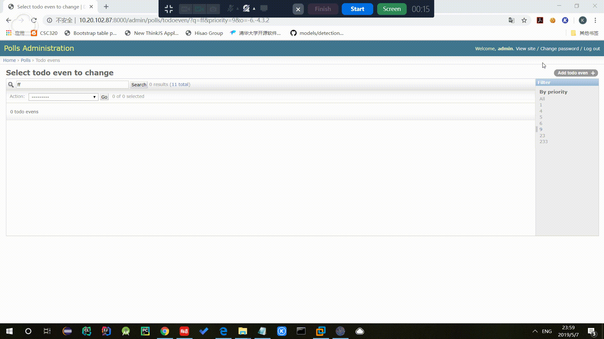
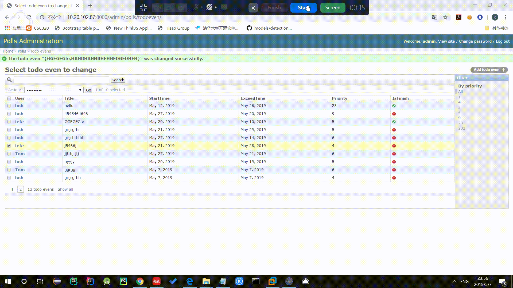
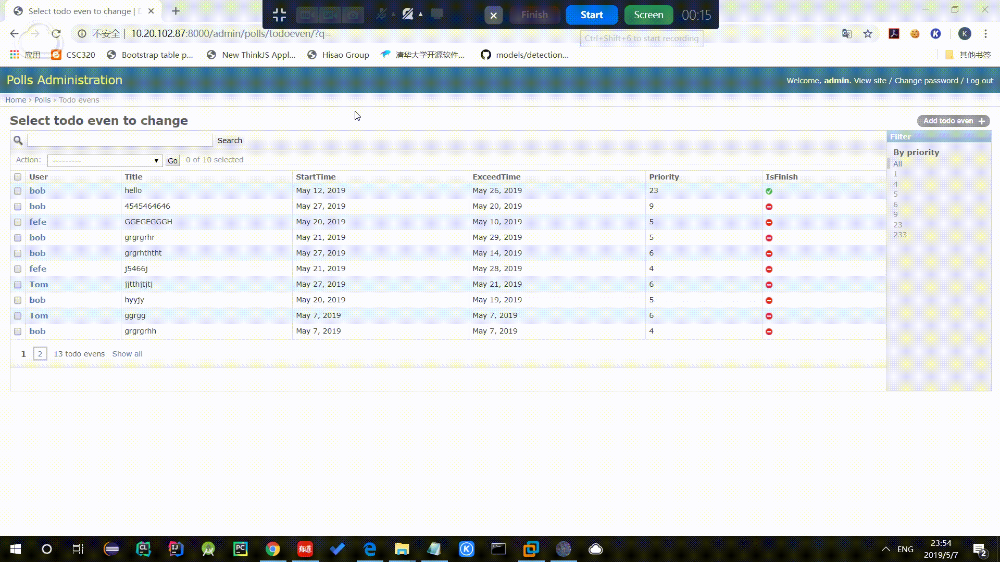
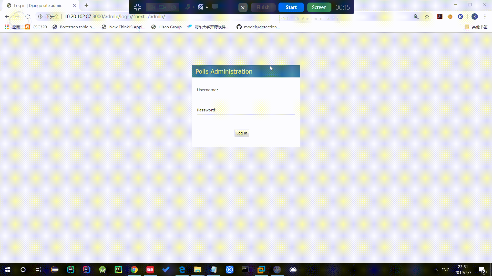
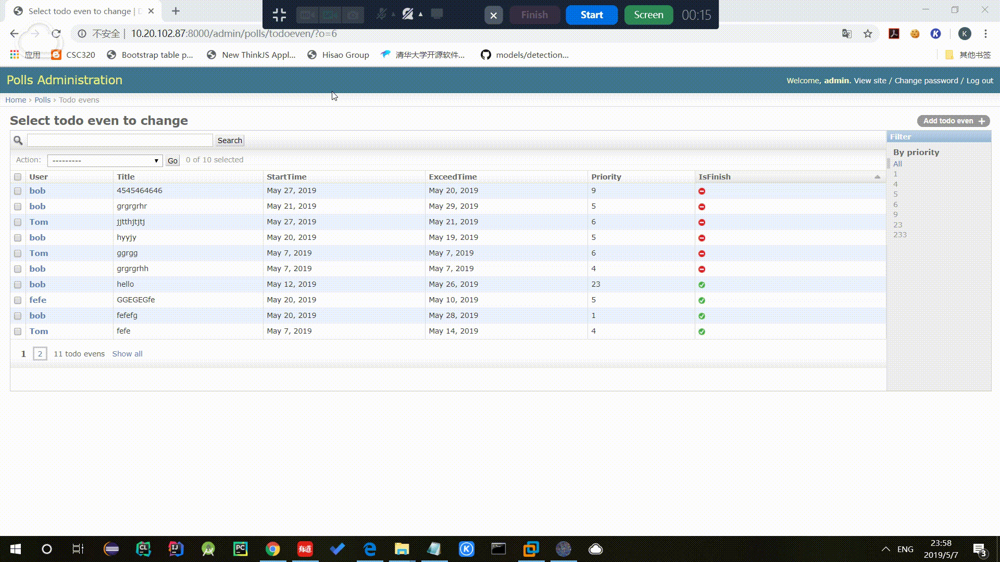

## a basic todo use Django, Django Rest Framework, postgreSQL, React

## 可用的url
1. /api/polls/ 
2. /index [name='index'] 
3. /^(?P<todoEven_id>[0-9]+)/$ [name='detail'] 
3. /^(?P<todoEven_id>[0-9]+)/id/$ [name='id'] 
4. /admin/ 
5. /react_table 
6. /^admin/

## 已完成的功能：

1. 增加一个待事项目

 

2. 删除一个待办项目

 

 
3. 标记一个待办事项为已完成
4. 编辑一个待办事项的具体内容

 

5. 列出所有的待办事项

 

 
6. 支持翻页：一页大小为十个item

 

 
7. 优先级 expire date排序： 点击相应列
8. 按事件标题搜索

 

## TODO

1. 将登陆方式改为用户登陆而非管理员登陆

2. 事件结束时间不早于开始时间检查

3. 与React结合渲染页面

4. 加入 CSS 及 其他前端模板

5. 404

